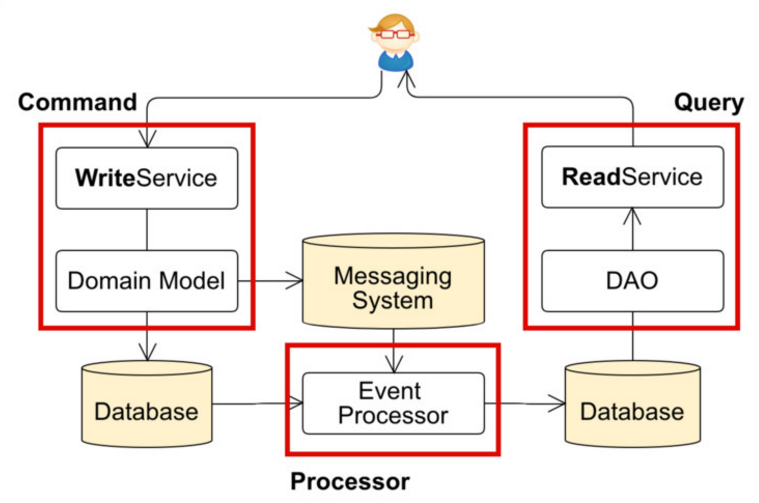
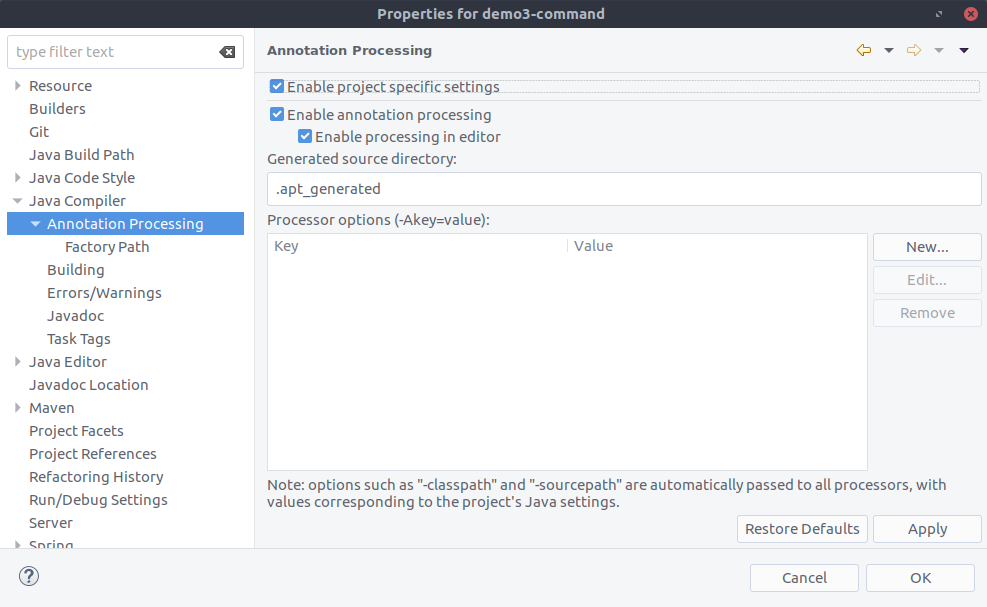
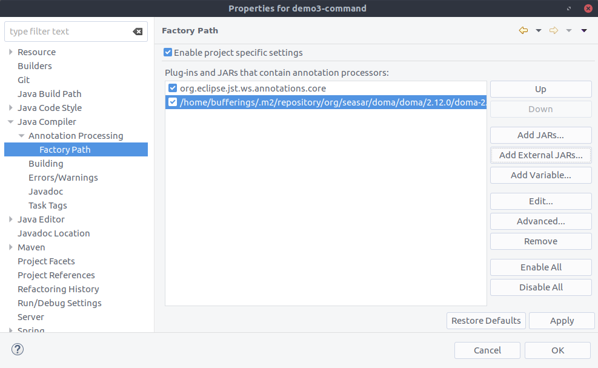
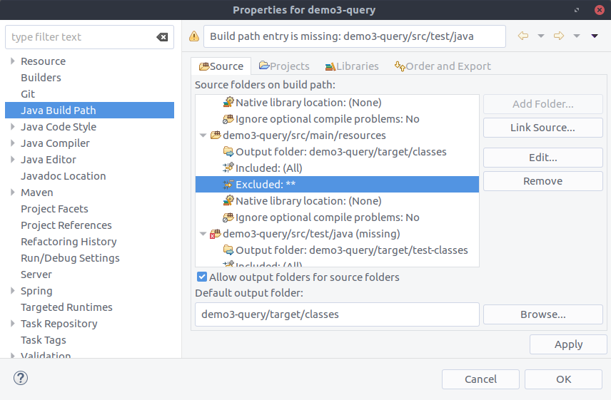

# jjug2017

[JJUG CCC 2017 Fall](http://www.java-users.jp/ccc2017fall/) 「Spring BootとKafkaでCQRSなアプリを動かしてみる」のデモプロジェクトです。

(スライドは後日アップロード予定です。アップロードしたらリンクを貼っておきます。)

## リポジトリの内容

* demo1: KafkaのJavaクライアントを使用してProducer/Consumerを使ってみる
* demo2: Spring BootとSpring Kafkaを使用してProducer/Consumerを使ってみる
* demo3: Command/Processor/QueryでCQRS的に動かしてみる
* tools: 使用するツールを入れています(docker-compose)

## 準備

### 1. Kafkaを起動

Kafkaのバージョン1.0.0リリースをダウンロードしてuntar

https://www.apache.org/dyn/closer.cgi?path=/kafka/1.0.0/kafka_2.11-1.0.0.tgz

```
> tar -xzf kafka_2.11-1.0.0.tgz
> cd kafka_2.11-1.0.0
```

ZooKeeperサーバーを起動

```
> bin/zookeeper-server-start.sh config/zookeeper.properties
```

Kafkaサーバーを起動

```
> bin/kafka-server-start.sh config/server.properties
```

### 2. ツールを起動

toolsのdocker-composeを起動

```
> cd tools
> docker-compose up
```

次のアプリケーションが起動します。

* cp-kafka-rest (kafka-topics-uiから使用)
* kafka-topics-ui
* mysql
* phpmyadmin

以下のURLにアクセスしてそれぞれ起動していることを確認できます。

* kafka-topics-ui
  * http://localhost:9002
* phpmyadmin
  * http://localhost:9003

## demo1: KafkaのJavaクライアントを使用してProducer/Consumerを使ってみる

* demo1-plain-java

ユニットテストで書いているのでテストを実行することで動作が確認できます。動かしたあとは、Kafka Topics UIで確認してみてください。

CLOVERのコードをほぼそのまま使用させていただきました。ありがとうございます

[Apache KafkaのQuickstartのサンプルを、JavaのClient APIで書き直してみた - CLOVER](http://d.hatena.ne.jp/Kazuhira/20170306/1488814266)

## demo2: Spring BootとSpring Kafkaを使用してProducer/Consumerを使ってみる

どちらもWebアプリにしています。Spring Kafkaが対応しているバージョンがKafka 0.11なのでそれをpom.xmlの中で1.0.0に変更して使用しています。

### demo2-boot-producer

次のURLにアクセスすることで{message}の部分に指定したメッセージを送信します。

```
> curl localhost:8200/{message}
```

### demo2-boot-consumer

受信したメッセージをINFOログでコンソールに出力します。

## demo3: Command/Processor/QueryでCQRS的に動かしてみる

全てWebアプリにしています。

### demo3概要

商品に対するコメントを登録(demo3-command)して、そのサマリー情報をページに表示する(demo3-query)というのを想像しながら動かしてみてください。demo3-processorはコマンド情報を元にクエリ情報を更新しています。



DBアクセスにはDomaを使用しています。

### 注意点

セッションで伝えたいことにポイントを絞って、それが動くことをお見せするためだけの最低限のデモです。なので詳細は全く考えていません。また、一番シンプルな実現方法を選んでいますので、このやり方でなければならない、このやり方をオススメする、というものではありません。

### DBの準備

MySQLに以下のSQLを流してテーブルとデータの準備をしてください

コマンド用

```
CREATE TABLE IF NOT EXISTS Product
(
  productId VARCHAR(36) PRIMARY KEY
  ,productName VARCHAR(30)
);

CREATE TABLE IF NOT EXISTS CustomerComment
(
  customerCommentId VARCHAR(36) PRIMARY KEY
  ,productId VARCHAR(36)
  ,customerComment VARCHAR(100)
);

INSERT INTO Product VALUES
   ('3926d0ad-5638-4ed1-b16a-b09197ddcc10', 'まぐろ')
;
```

クエリ用

```
CREATE TABLE IF NOT EXISTS ProductPage
(
  productId VARCHAR(36) PRIMARY KEY
  ,productName VARCHAR(30)
  ,commentCount INT
  ,latestComment VARCHAR(100)
);

INSERT INTO ProductPage VALUES
   ('3926d0ad-5638-4ed1-b16a-b09197ddcc10', 'まぐろ', 0, '')
;
```

### demo3-command

次のURLにアクセスすることで{comment}の部分に指定したコメントを登録します。

```
> curl localhost:8300/{comment}
```

まぐろに対するCustomerCommentを追加し、更新があったことをKafkaに伝えています。

### demo3-processor

コメントが追加されたというイベントを受け取って、ProductPageを更新します。クエリ用テーブルのまぐろに対するコメント数と、最新のコメントを更新します。

### demo3-query

クエリ用テーブルから情報を取得して返します。

```
> curl http://localhost:8302/
```

## その他

### Eclipseでdemo3のアプリケーションが起動できない場合

自動で設定されていない場合はdemo3の各プロジェクトに対して、以下の手順でDomaのJARをFactory Pathに追加してください。

プロジェクトの設定からAnnotation Processingを選択し、Enable project specific settingsをチェック



Factory PathもEnable project specific settingsをチェックし、Factory PathにDomaのJARを追加する。Add External JARsから.m2ディレクトリ内のDomaのJARを指定。



これを、demo3の3つのプロジェクト全てに設定してください。

### EclipseでDomaのエラーが出る場合

Eclipseでプロジェクトを取り込んだ時に、demo3-processorとdemo3-queryで次のようなDomaのエラーが出る場合

> [DOMA4019] ファイル[META-INF/com/example/demo/ProductPageDao/findAll.sql]がクラスパスから見つかりませんでした。ファイルの絶対パスは"/home/bufferings/jjug2017/jjug2017/demo3-query/target/classes/META-INF/com/example/demo/ProductPageDao/findAll.sql"です。

プロジェクトの設定からJava Build Pathを選択し、src/main/resourcesの `Excluded: **` をRemoveする。



`Excluded: **` を選択した状態で右側の `Remove` ボタンをクリック。

これを、demo3のprocessorとqueryのプロジェクトに設定してください。(もしcommandプロジェクトにSQLファイルを追加したい場合は、commandプロジェクトにも設定してください)

### Producerアプリが終了しない場合

僕の環境ではProducerアプリが終了できないので強制終了しました。

### Topicを削除したい場合

トピックの削除は次の通りです

```
> bin/kafka-topics.sh --delete --zookeeper localhost:2181 --topic (トピック名)
```
